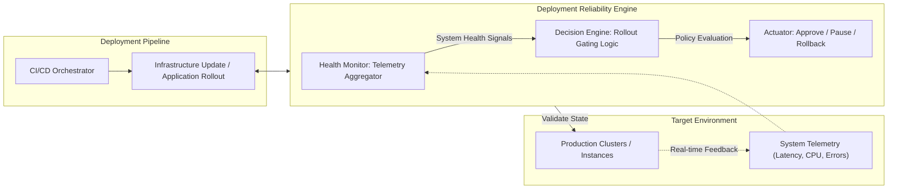

# Deployment Reliability Engine (DRE)

## Overview
The **Deployment Reliability Engine (DRE)** is a specialized operational control framework designed to automate the safety gating of software deployments and infrastructure changes. While standard Continuous Integration and Continuous Deployment (CI/CD) pipelines focus on the speed of delivery, DRE focuses on the **integrity of the runtime environment**. It utilizes real-time system health signals to pause, block, or rollback unsafe operations before they can escalate into large-scale outages.

## Addressing the Systemic Risk of Deployment Failures
In modern distributed systems, outages are frequently caused not by hardware failure, but by routine operational actions such as application rollouts, cluster upgrades, or instance repairs. DRE provides a technical solution to several critical industry vulnerabilities:

* **The CrowdStrike Precedent**: The 2024 global IT outage demonstrated that a single faulty update can bypass traditional safeguards and paralyze critical infrastructure across healthcare, aviation, and finance sectors. DRE acts as an automated circuit breaker for such updates by enforcing health-gated rollouts that stop the propagation of faulty code at the earliest possible stage.
* **Blast Radius Containment**: Without sophisticated gating, a single deployment error can impact 100% of a service's capacity. DRE strictly limits the blast radius by ensuring that a deployment only proceeds if the initial small-scale impact meets strict health criteria.
* **Standardizing Operational Safety**: While hyperscale cloud providers have internal tools for health-gated operations, these technologies are often proprietary. DRE provides an open-source, reusable framework for the broader engineering community to implement high-level safety standards without the need for massive internal engineering organizations.

## Key Features
* **Health-Gated Rollout Decisioning**: Analyzes real-time telemetry, including error rates and latency, to determine if a deployment is safe to proceed to the next phase.
* **Automated Blast Radius Control**: Limits the scope of potential impact by enforcing strictly staged rollouts across distributed clusters.
* **Autonomous Safety Interventions**: Triggers immediate rollbacks or deployment freezes when critical health thresholds are breached.
* **Multi-Source Signal Aggregation**: Ingests health data from various observability platforms including Prometheus, Datadog, and OpenTelemetry.
* **Infrastructure Repair Safety**: Coordinates automated instance replacements to ensure they do not occur during periods of high system stress or dependency degradation.

## Quick Start

### Prerequisites
* Go 1.21 or higher
* Access to a Prometheus instance or OpenTelemetry collector for real-time metrics

### Installation
1. Clone the repository:
```bash
git clone [https://github.com/jiayu8302/Deployment-Reliability-Engine.git](https://github.com/jiayu8302/Deployment-Reliability-Engine.git)
cd Deployment-Reliability-Engine
```
2. Build the DRE actuator:
```bash
go build -o dre-actuator ./cmd/dre-actuator
```

### Defining a Safety Policy
Create a policy.json to define your operational guardrails. DRE will use these thresholds to validate every stage of your deployment:
```json
{
  "max_error_rate": 0.01,
  "latency_threshold_ms": 200,
  "max_blast_radius_pct": 10,
  "health_check_window": "5m"
}
```
### Running the Engine
Integrate DRE into your deployment workflow to act as a safety gate:
```bash
./dre-actuator --policy policy.json --metrics-url http://prometheus:9090
```
### Architecture: The Safety Gate Pattern
DRE acts as a decision-making layer between the deployment orchestrator and the target production infrastructure.

## Target Beneficiaries
DRE is designed to advance the reliability of digital infrastructure across several key sectors:

* **DevOps and SRE Teams**: Provides a standardized, vendor-neutral framework for implementing safety gates across diverse technology stacks.
* **High-Compliance Sectors**: Ensures that all operational changes meet strict health-based validation criteria to protect critical services in finance and healthcare.
* **Public Sector Engineering**: Offers a transparent and reusable pattern for securing government digital services against catastrophic deployment errors.
* **Startups and Small Enterprises**: Democratizes advanced resilience engineering, allowing smaller teams to achieve high levels of operational safety without the resources of hyperscale providers.

## Roadmap
* **Phase 1 (Complete)**: Core health signal ingestion API, basic rollout gating logic, and Prometheus integration.
* **Phase 2 (In-Progress)**: Advanced anomaly detection for health baselines and automated multi-region rollback triggers.
* **Phase 3**: Cross-cloud deployment adapters and deep integration with Service Mesh architectures via the xDS API.